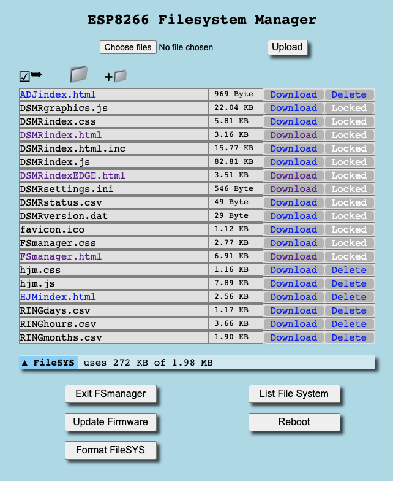

# FSmanager

Met de FSmanager is het mogelijk bestanden op het LittleFS \(Little File System\) te plaatsen of ze ervan te verwijderen. Ook kan de inhoud van bestanden die aanwezig zijn op het LittleFS worden getoond \(dit is niet mogelijk met .html bestanden omdat deze direct door de browser geïnterpreteerd -en dus uitgevoerd- worden\).

Daarnaast kent de FSmanager nog de volgende functies:

* Starten van de Update Server    `[Update Firmware]`
* Rebooten van de DSMR-logger`[Reboot]`
* Formatteren van het LittleFS   `[Format FileSYS]`
* Soms blijft het scherm leeg. Klik dan op de knop`[List File System]`
* Met de knop`[Exit FSmanager]` keer je terug naar het hoofdscherm.

Er zijn verschillende manieren om de FSmanager te starten:

* Vanuit het DSMR-logger hoofdscherm door op het icoon  te klikken
* Door in de browser de volgende URL in te toetsen           `http://dsmr-api.local/FSmanager` of:          `http://<ipAdresVanDeLogger>/FSmanager`

### Het LittleFS formatteren

De FSmanager heeft de mogelijkheid om het LittleFS te formatteren. Deze functie is alleen nodig als het LittelFS problemen vertoont. Normaal gesproken is deze functie nooit nodig en daarom is de knop ook uitgeschakeld. Om de knop te activeren moet het bestand met de  naam **`!doNotFormat`**\(het eerste teken is een uitroep-teken\) ge-delete worden. De inhoud van het bestand is niet belangrijk. Zodra dit bestand afwezig is wordt de \[Format FileSYS\] knop geactiveerd.


Pas op!  
Door het LittleFS te formatteren raak je álle bestanden die op het filesysteem staan kwijt!  
Maak zo nodig eerst kopiëren van belangrijke bestanden.


Na iedere herstart zal de DSMRloggerAPI firmware controleren of het File Systeem correct geformatteerd is. In dat geval plaatst het automatisch een bestand met de naam `!doNotFormat` in de root directory.

