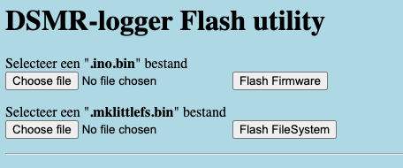
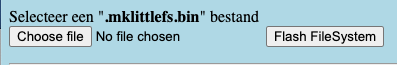
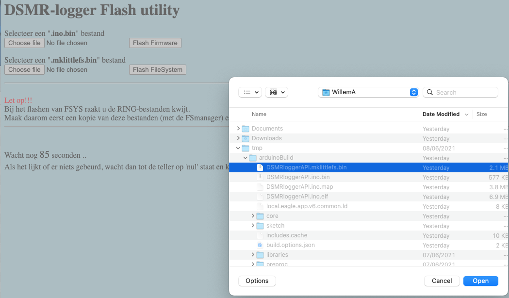

# Update Server

Met de Update Server is het mogelijk om firmware en het File Systeem naar een DSMR-logger te flashen.

Je kunt de Update Server op twee manieren opstarten:

* Door op de knop `[Update Firmware]` in de FSmanager te klikken
* Door in de browser de volgende URL in te toetsen:      **http://dsmr-api.local/update** of:      **http://&lt;hetIPadresVanDeDSMRlogger&gt;/update**

### Flash Firmware

Om \(nieuwe\) firmware te flashen moet je op de knop `[Choose file]` onder de kop "Selecteer een **.ino.bin** bestand" klikken.

Er verschijnt nu een drop-down window waar je de gewenste firmware kunt selecteren.

Klik vervolgens op `[Flash Firmware]`

### Flash File Systeem

Om een nieuw bestands systeem op de DSMR-logger te flashen klik je op de knop \[Choose file\] onder de kop "Selecteer een **.mklittlefs.bin** bestand".

Er verschijnt nu een drop-down window waar je het gewenste **`.mklittlefs.bin`** bestand systeem kunt selecteren.

Klik vervolgens op de knop `[Flash FileSYS]`

### Flashen is geslaagd

