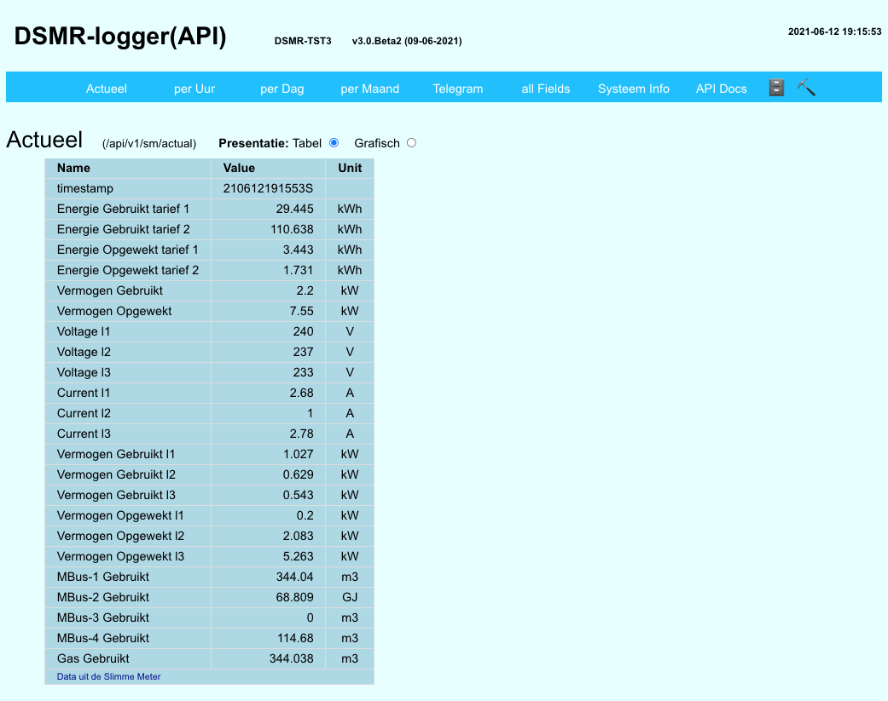
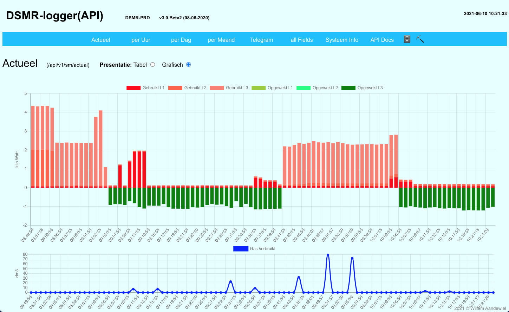

# Upgrade DSMRloggerAPI v2 to v3

Het upgraden vanaf de _DSMRloggerAPI **v2**_ firmware naar de _DSMRlogger**API**_ ****firmware v3 is nodig omdat het SPIFFS bestand systeem binnenkort niet meer ondersteund wordt door de esp8266 core. Versie 3 van de DSMRloggerAPI firmware maakt daarom gebruik van het zgn. LittleFS \(little file system\) en daarom is het noodzakelijk de volgende stappen uit te voeren:

* Gebruik de FSexplorer om de **`RINGhours.csv`, `RINGdays.csv`** en**`RINGmonths.csv`** naar je computer te downloaden \(dit hoef je alleen te doen als je de opgebouwde historie na de upgrade terug wilt zien in de GUI van de DSMR-logger met de nieuwe firmware\).

* Download de laatste \(nieuwste\) versie `DSMRloggerAPI.ino.bin` en `DSMRloggerAPI.mklittlefs.bin` files van [github](https://github.com/mrWheel/DSMRloggerAPI/releases/tag/v3.0.Beta2) naar je computer.
* Klik op de knop `[Update Firmware]`, selecteer  met `[Choose File]` het goede firmware bestand \(DSMRloggerAPI**.ino.bin**\) en flash eerst deze nieuwe firmware door op de knop `[Flash Firmware]` te klikken.

* Wacht na de boodschap dat de update goed is gegaan tot de teller op 10 staat en klik dan in de browser op `[Back]` , tik in de URL-balk het IP-Adres van de DSMR-logger in met daarachter "**`/update`**" of wacht tot de DSMR-logger opnieuw is opgestart. Je komt nu weer in het scherm waar je nieuwe firmware kunt flashen.
* Klik nu op de knop `[Update Firmware]`, selecteer  door op `[Choose File]` onder de tekst "_Selecteer een **.mklittlefs.bin** bestand_" te klikken. Selecteer nu het zojuist gedownloade **DSMRloggerAPI**.**mklittlefs.bin** bestand en klik op de knop `[Flash FileSystem]`. 

  
 Als het flashen goed is gegaan verschijnt na enige tijd het start scherm van de DSMR-logger.

Gebruik vervolgens de FSmanager om de, in stap 1 naar de PC gekopieerde, RINGbestanden terug naar de DSMR-logger te zetten.

### Converteren PRD bestanden van DSMRloggerWS

De DSMRloggerAPI firmware heeft een mogelijkheid om bestanden van de DSMRloggerWS \(zgn. **`PRD-bestanden`**\) automatisch te converteren naar het door de DSMRloggerAPI gebruikt \(_RING_\) formaat.

Nadat je de DSMRloggerAPI hebt geïnstalleerd en deze 'werkt' kun je met de **`FSmanager`** de drie bewaarde **`PRD-bestanden`** naar het FileSystem uploaden.

Upload vervolgens een bestand met de exacte naam **`!PRDconvert`** \(het eerste teken is een uitroep-teken\) naar het FileSystem \(je moet dit bestand zelf aanmaken, de inhoud van is niet belangrijk\). Start de DSMR-logger nu opnieuw op \(klik op de knop \[ReBoot\]\) en de RING bestanden zullen automatisch gevuld worden met de inhoud van de PRD bestanden.


Let op!   
Je moet ervoor zorgen dat de PRD of RING bestanden _**zo actueel mogelijk**_, maar in ieder geval _**binnen dezelfde dag**_ en bij voorkeur _**in hetzelfde uur**_ waarop je de conversie uitvoert, nog ge-update zijn!   
Missen er uren of dagen dan geeft dit vreemde resultaten \(maar dat komt na verloop van tijd vanzelf goed\)!


