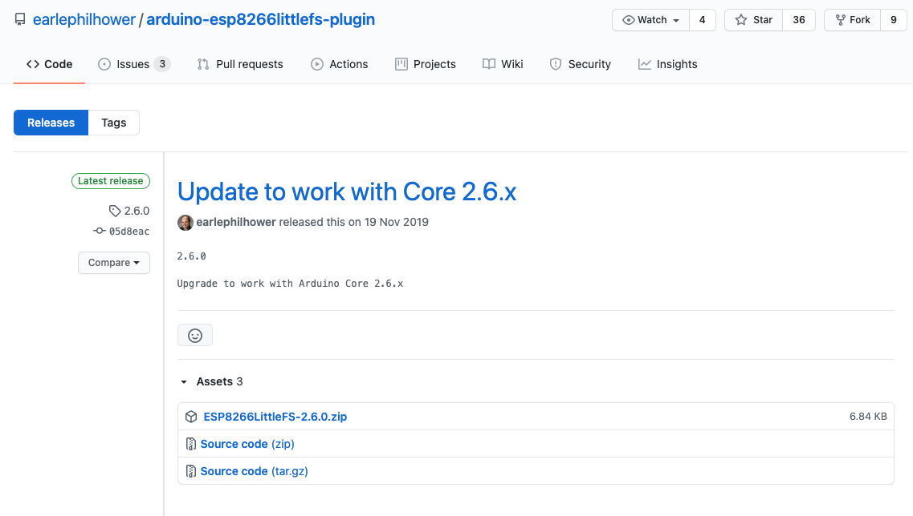
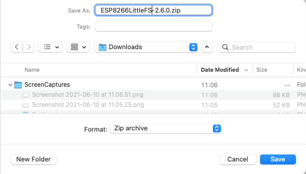
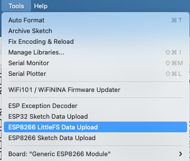

# ESP8266 LittleFS Data Upload Tool

### Installatie LittleFS Data Upload Tool 

Eén van de mooie eigenschappen van de ESP8266 is dat er flash geheugen in zit. Flash geheugen is geheugen dat zijn inhoud ook zonder spanning behoud. Vergelijk het met een SD-kaart. Het flash geheugen is, afhankelijk van het bordje, 512kB tot 16MB\(!\) groot. Een deel van dit flash geheugen wordt gebruikt om jouw programma in op te slaan. Wat er over blijft kan als bestand-systeem worden ingericht \(het zgn. _LittleFS_\).

Je kunt in je programma dit bestand-systeem niet alleen gebruiken om \(bijvoorbeeld meet-\) gegevens maar ook om de inhoud van een web-pagina \(`index.html`\) of een configuratie-bestand in op te slaan.

Om het LittleFS voor dit soort bestanden te kunnen gebruiken moet je een `plug-in` in je Arduino Projecten map installeren.

De plug-in haal je [hier](https://github.com/earlephilhower/arduino-esp8266littlefs-plugin/releases) vandaan. Ga naar deze [github](https://github.com/earlephilhower/arduino-esp8266littlefs-plugin/releases) pagina en download het meest recente .zip bestand ..

Download vervolgens het **`ESP8266FS-0.5.0.zip`** bestand door er op te klikken.

En bewaar het bestand op een plek die voor jou handig is.

Ga nu naar je `Sketchbook Location` map en maak daarin een nieuwe map `tools` aan \(als deze nog niet bestaat\). Pak het zojuist ge-download-de zip bestand uit in deze `tools` map. Er wordt nu een aantal nieuwe mappen aangemaakt waar de plug-in wordt neergezet. Het pad ziet er ongeveer zo uit:

`<sketchbook location>/tools/ESP8266FS/tool/esp8266fs.jar`

Start de Arduino IDE opnieuw op.

Op de menu-balk zie je nu onder \[**`Tools`**\] een nieuwe optie: **`ESP8266 LittleFS Data Upload`**.

Als er onder de map van je Sketch óók een map **`data`** staat, dan kun je de bestanden die in deze **`data`-map** staan met het **`ESP8266 LittleFS Data Upload`** tool naar het File Systeem van de ESP8266 flashen.

De bestands-tree van de DSMRloggerAPI firmware data-map ziet er zo uit:  

Het `ESP8266 LittleFS Data Upload` tool zal alle bestanden die in de `data`-map zitten naar het File Systeem van de aangesloten ESP8266 uploaden.

Ga naar: \[**`tools`**\] -&gt; \[**`ESP8266 LittleFS Data Upload`**\]

Randvoorwaarde is natuurlijk dat het LittleFS groot genoeg is! In de selectie van je board moet je, behalve het juiste type board ook aangeven hoeveel ruimte van je Flash geheugen je wilt gebruiken voor het bestand-systeem \(vóórdat je je programma naar de ESP8266 upload!\).

Normaliter zou je dit zo groot mogelijk willen maken, maar als je “Over The Air” programma’s op je ESP8266 wilt zetten \(dus zonder fysieke verbinding maar via WiFi\) dan moet je er rekening mee houden dat je twee maal de grootte van je programma nodig hebt om dit te kunnen doen. Wat er overblijft kun je als bestand-systeem gebruiken.

